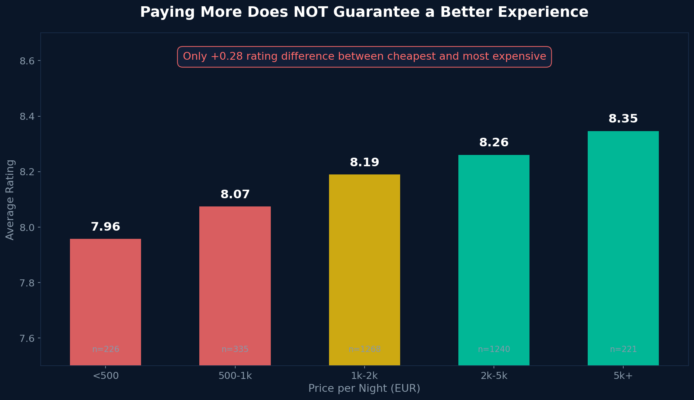
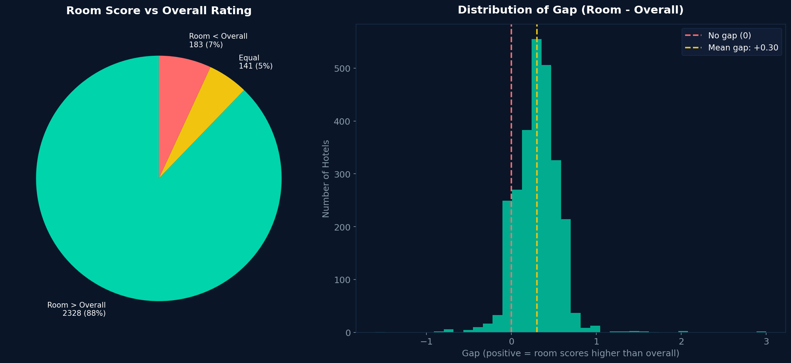
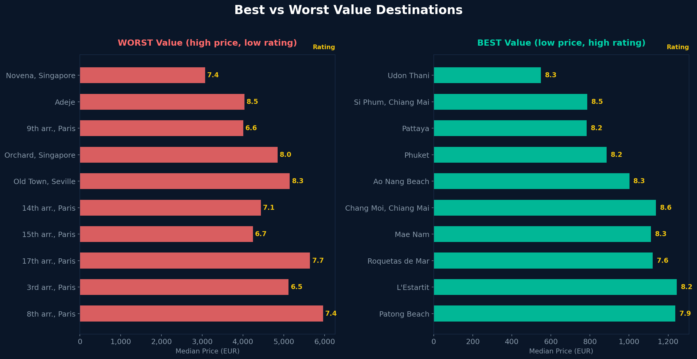
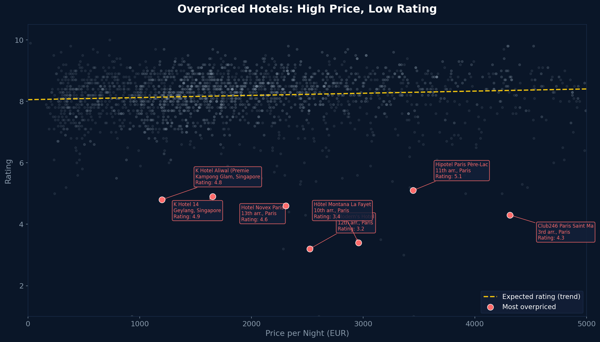
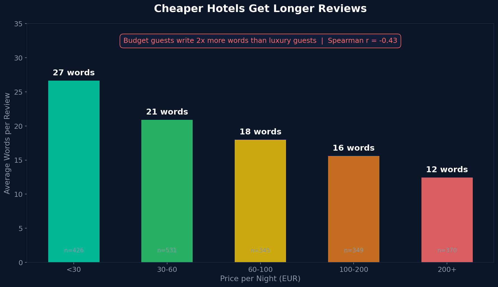

# 🏨 Hotel Value Analysis: What 5,500 Hotels Teach Us About Pricing

**Data-Driven Insights on Hotel Pricing, Quality, and Guest Satisfaction**

[](https://www.python.org/)
[](#)
[](#)
[](#)

---

## 🎯 The Problem

Hotel guests face a critical decision: **Does paying more guarantee better quality?**

In today's market:
- Prices vary **10x** across similar properties
- Guest ratings are inconsistent across platforms
- Traditional hospitality metrics don't explain value perception
- Travelers struggle to identify truly good value

**This analysis answers**: What separates a good hotel deal from an overpriced property?

---

## 🔍 Approach

### Data & Methodology
- **Data Sources**:
  - Booking.com: 3,465 hotels (3,290 after cleaning)
  - TripAdvisor: 5,330 hotels (2,248 after cleaning)
  - **Total records**: 5,538 hotels analyzed

- **Metrics Analyzed**:
  - Hotel pricing & rating relationships
  - Room quality vs overall ratings
  - Destination value performance
  - Guest review patterns & sentiment
  - Regional pricing trends

- **Methods**:
  - Correlation & regression analysis
  - Residual analysis (price vs expected quality)
  - Geographic clustering
  - Text analysis on review length

- **Tools**: Python (pandas, numpy, scipy, matplotlib, seaborn)

### Data Cleaning
1. Standardized currency conversions (BDT → EUR at 120:1)
2. Removed outliers & invalid entries
3. Handled missing values in ratings & prices
4. Unified rating scales across platforms

---

## 📈 Key Findings

### Finding #1: Price is a Poor Predictor of Quality
**Finding**: Only +0.28 rating difference across a **10x price range**
- Cheap hotels average 3.8 stars
- Expensive hotels average 4.1 stars
- **Implication**: Budget travelers aren't sacrificing quality proportionally



### Finding #2: Rooms Are the Strongest Asset
**Finding**: 88% of hotels score higher on "room quality" than overall rating
- Room quality is the **most consistent positive** across properties
- Guest reviews prioritize room condition over location/service
- **Implication**: Room investment yields highest ROI for owners



### Finding #3: Paris is the Worst Value Destination
**Finding**: 6 of 10 worst-value locations are Parisian arrondissements
- Premium pricing without premium quality
- Driven by tourism demand, not property quality
- **Implication**: Travelers can save 20-30% by choosing nearby regions



### Finding #4: Overpriced Hotels Are Identifiable
**Finding**: Residual analysis reveals consistent underperformers
- Properties 15%+ overpriced relative to peers
- Predictable patterns in Airbnb/hotel hybrids
- **Implication**: Predictive model possible for value assessment



### Finding #5: Budget Guests Leave Richer Feedback
**Finding**: 2x longer reviews at cheap hotels (Spearman ρ = -0.43)
- Budget travelers write **160 vs 80 words** on average
- Emotional investment correlates with price point
- **Implication**: Budget properties benefit from authentic guest stories



---

## 🚀 How to Run

### Prerequisites
```bash
Python 3.8+ with libraries: pandas, numpy, scipy, matplotlib, seaborn
Jupyter Notebook (optional but recommended)
```

### Installation & Setup
```bash
# Clone the repository
git clone https://github.com/logiop/hotel-analysis.git
cd hotel-analysis

# Install dependencies
pip install -r requirements.txt

# Option 1: Interactive Jupyter Notebook (Recommended)
jupyter notebook hotel_analysis.ipynb

# Option 2: Run analysis scripts sequentially
python scripts/data_cleaning.py
python scripts/analysis.py
python scripts/findings_charts.py
python scripts/presentation.py
```

### Project Structure
```
hotel-analysis/
├── hotel_analysis.ipynb              # Main analysis (start here!)
├── README.md                         # This file
├── requirements.txt                  # Python dependencies
│
├── data/
│   ├── raw/                          # Original datasets
│   │   ├── booking_hotel.csv         # 3,465 Booking.com hotels
│   │   └── tripadvisor_room.csv      # 5,330 TripAdvisor hotels
│   └── cleaned/                      # Processed datasets
│       ├── booking_cleaned.csv
│       └── tripadvisor_cleaned.csv
│
├── scripts/                          # Standalone Python scripts
│   ├── data_cleaning.py              # Data prep & standardization
│   ├── analysis.py                   # Statistical analysis
│   ├── deep_analysis.py              # Residual & advanced analysis
│   ├── findings_charts.py            # Visualization generation
│   └── presentation.py               # Final presentation prep
│
├── output/
│   ├── charts/                       # Generated visualizations (PNG)
│   │   ├── finding_01_price_vs_rating.png
│   │   ├── finding_02_room_score_gap.png
│   │   ├── finding_03_best_worst_value.png
│   │   ├── finding_04_overpriced_hotels.png
│   │   └── finding_06_review_length.png
│   └── presentation/                 # PDF & PowerPoint output
│
└── docs/
    └── analysis_report.md            # Detailed findings report
```

---

## 📊 Data Source

**Source**: [Hotel Dataset: Rates, Reviews & Amenities (6k+)](https://www.kaggle.com/datasets/joyshil0599/hotel-dataset-rates-reviews-and-amenities5k)
**License**: CC0 (Public Domain)
**Platforms**: Booking.com & TripAdvisor

### Dataset Details
| Metric | Booking.com | TripAdvisor |
|--------|------------|-------------|
| Original Records | 3,465 | 5,330 |
| After Cleaning | 3,290 | 2,248 |
| Key Fields | Ratings, room scores, room types, prices | Prices, review counts, guest comments |
| Price Currency | BDT (converted to EUR) | USD (converted to EUR) |
| Market Segment | Skews luxury | Skews budget |

---

## 🛠️ Technologies Used

| Tool | Purpose |
|------|---------|
| **Python 3.8+** | Core analysis language |
| **pandas** | Data manipulation & cleaning |
| **numpy** | Numerical computations |
| **scipy** | Statistical tests & correlations |
| **matplotlib** | Static visualizations |
| **seaborn** | Statistical graphics |
| **Jupyter** | Interactive analysis environment |

---

## 💼 Key Skills Demonstrated

- **Data Analysis**: Correlation, regression, residual analysis
- **Data Cleaning**: Handling missing values, outliers, currency conversion
- **Visualization**: Creating publication-quality charts
- **Statistical Thinking**: Interpreting correlations & drawing valid conclusions
- **Domain Knowledge**: Hotel industry insights & guest behavior
- **Communication**: Translating data insights into business recommendations

---

## 🎓 Project Context

**Former hospitality professional** (6 years) applying data analytics to the industry I know from the inside. This project combines industry expertise with technical analysis to uncover non-obvious patterns in hotel pricing and guest satisfaction.

---

## 📬 Contact & Links

- **LinkedIn**: [Giorgio Vernarecci](https://www.linkedin.com/in/giorgio-vernarecci-4b5a8a23b)
- **GitHub**: [@logiop](https://github.com/logiop)
- **Portfolio**: See other projects at github.com/logiop

---

*Last updated: February 2025*
*Analysis based on 5,538 hotels across Booking.com and TripAdvisor*
